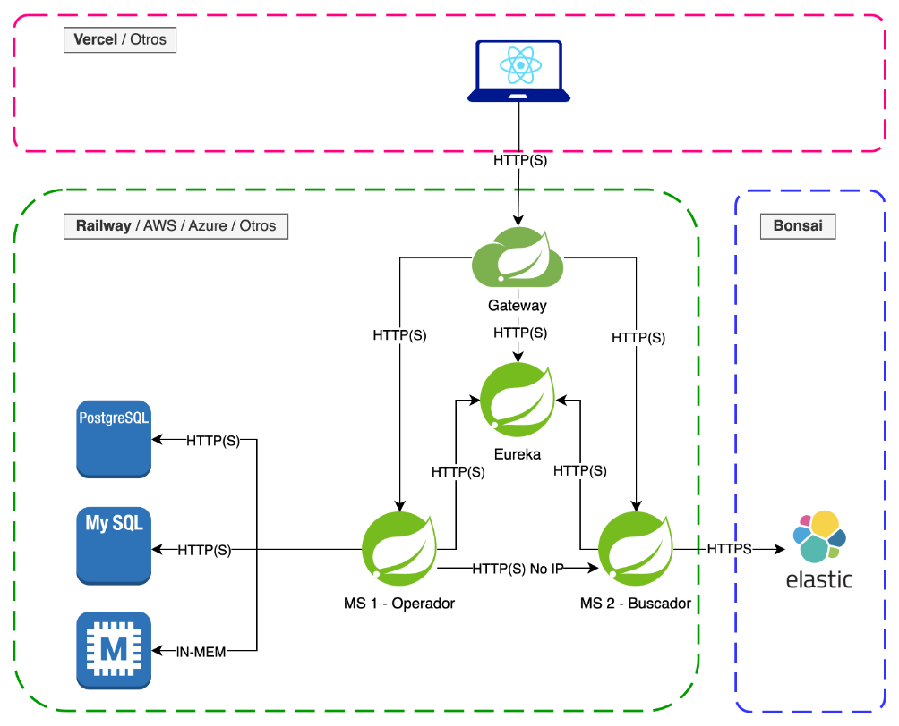
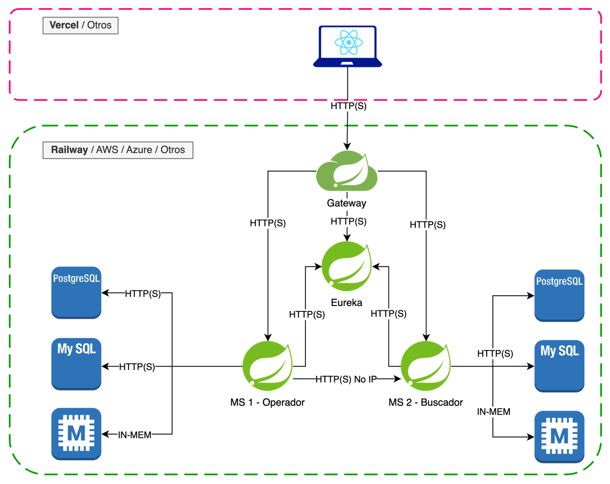
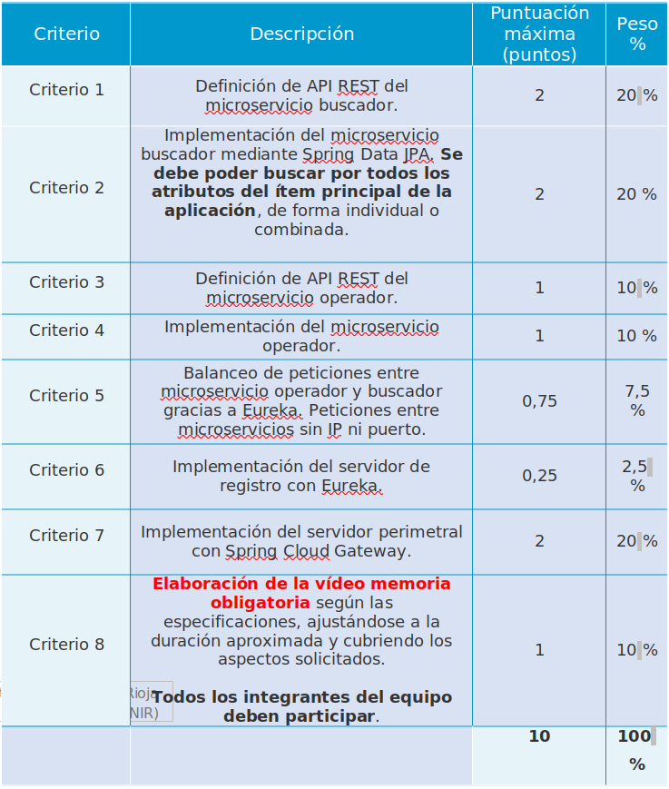

Laboratorio. Desarrollo de un back-end utilizando Java y Spring

Se recomienda realizar la actividad en un grupo de 3 a 5 personas.

Objetivos

Las tres actividades que se llevarán a cabo en la asignatura Desarrollo Web Full Stack tienen como objetivo:

* Desarrollar un front-end haciendo uso de HTML5, CSS3, JavaScript y React.
* Desarrollar un back-end haciendo uso de una arquitectura orientada a microservicios, donde cada microservicio expondrá
  una API REST haciendo uso de Java, y Spring.
* Integrar ambas partes y desplegar Front-End y Back-End tanto en local como de forma pública.
* Hacer uso de bases de datos relacionales y del motor de búsqueda Elasticsearch.

Esta segunda actividad consiste en la realización del back-end de la aplicación web. Por ello, esta actividad permite 
poner en práctica lo estudiado en los Temas 6, 7 y 8:

* Diseño y consumo de las API REST.
* Arquitecturas de microservicios.
* Lenguaje de programación Java.
* Uso del framework Spring.
  * Spring Core.
  * Spring Boot.
  * Spring Data.
  * Spring Cloud Netflix Eureka.
  * Spring Cloud Gateway.

#### Pautas de elaboración

Esta actividad abarca la creación del back-end de una aplicación web con lenguaje de programación Java y del framework 
Spring. Para ello, lo primero que se deberá elegir es uno de los front-end realizados en la Actividad 1 por algún 
integrante del equipo.

El back-end desarrollado deberá estar compuesto por dos microservicios (como mínimo). 
* Microservicio buscador: el encargado de acceder y tratar con una base de datos y con el ítem «insignia» de nuestra 
  aplicación, que podría ser un producto, un libro, una película, etc. La API que exponga este microservicio debe, 
  además de permitir crear, modificar (si la modificación es total o parcial dependerá del contexto) o eliminar ítems, 
  permitir buscar por todos los atributos del ítem sobre el que trabaje la aplicación (de forma individual o combinada).
  La base de datos relacional puede ser H2 o MySQL/PostgreSQL.
* Microservicio operador: será el encargado de ejecutar las acciones principales de la aplicación (registrar compras, 
  alquilar libros, películas, etc.). Para esto realizará peticiones HTTP al microservicio buscador siempre que se 
  necesite validar aquellos ítems sobre los que se está ejecutando una operación (principalmente, que existen y que 
  están en un estado correcto, como por ejemplo que haya stock en el caso de ser recursos físicos). El resultado (la 
  creación de esa operación) se debe persistir en una base de datos relacional. Puede ser H2 o MySQL/PostgreSQL.

Ambos microservicios (buscador y operador) deberán exponer una API REST bien definida que siga las recomendaciones del 
Tema 6. Se penalizará duramente una API que no siga tales recomendaciones.

A su vez, ambos microservicios deberán registrarse automáticamente en su arranque en un servidor de Eureka, por lo que 
cualquier petición HTTP entre operador y buscador tiene que hacerse utilizando nombres relativos y no se debe incluir en
ningún caso una dirección IP y un puerto.

Por último, utilizaremos Cloud Gateway para crear un proxy inverso, que será el punto de entrada de cualquier cliente a
nuestro back-end. Cloud Gateway deberá poder redirigir correctamente al microservicio correspondiente en función de la 
petición que reciba. Para obtener la valoración máxima en este apartado será necesario utilizar Cloud Gateway 
transcribiendo peticiones POST desde el frontal hacia las correspondientes GET, POST, PUT, PATCH o DELETE en cada 
microservicio.

En caso contrario (usar un Cloud Gateway que no transcriba peticiones), este apartado será puntuado con una puntuación 
máxima de 2,5 puntos (0,5 sobre la nota final de la actividad).

Todos los componentes de la arquitectura deben poder desplegarse en local correctamente una vez sean importados en un 
entorno de desarrollo como Eclipse o IntelliJ IDEA.

Dado que aún no se ha estudiado Elasticsearch, se sustituirá este componente de la arquitectura final por una base de 
datos relacional diferente a la que usará el microservicio operador. Es decir, cada microservicio opera siempre contra 
una base de datos diferente y no contra el mismo schema. El escenario final de esta actividad es, por tanto, el 
siguiente (nótese que en esta actividad no es necesario modificar el proyecto anterior del Front-End, algo que se hará 
en la tercera actividad):

La entrega consistirá en un único archivo ZIP que contendrá:
* Vídeo memoria obligatoria en formato MP4 de la actividad.
* Proyectos con el código de Eureka, Cloud Gateway y microservicios. Un directorio por proyecto, sin comprimir. Se 
  incluye todo el contenido de los proyectos sin la carpeta target.
* En caso de ser necesario, archivos SQL con sentencias DDL y DML necesarias para disponer del mismo conjunto de datos 
  que se ha usado durante el desarrollo.

#### Extensión y formato de la vídeo memoria

La vídeo memoria tendrá una duración aproximada de 10 minutos y deberá visitar los siguientes aspectos de tu actividad:
1. Introducción. Al inicio, ningún componente de la arquitectura está desplegado. Se hará una introducción a la 
   aplicación para la cual se ha desarrollado el Back-End, indicando principalmente por qué motivo se eligió.
2. API REST del buscador. Se indicará cuáles son las operaciones que la API de este microservicio expone.
3. API REST del operador. Se indicará cuáles son las operaciones que la API de este microservicio expone.
4. Se despliegan los componentes. Tras desplegar Eureka, Cloud Gateway y los microservicios explorarás el Dashboard de 
   Eureka y el visor de rutas de Cloud Gateway para confirmar que todo se ha desplegado de forma correcta. Tras ello, 
   pasarás a realizar mediante Postman o Swagger alguna llamada al gateway que implique una comunicación entre el 
   microservicio operador y el buscador, mostrando su resultado.
5. Conclusiones. Añade cualquier comentario que desees, así como feedback.

